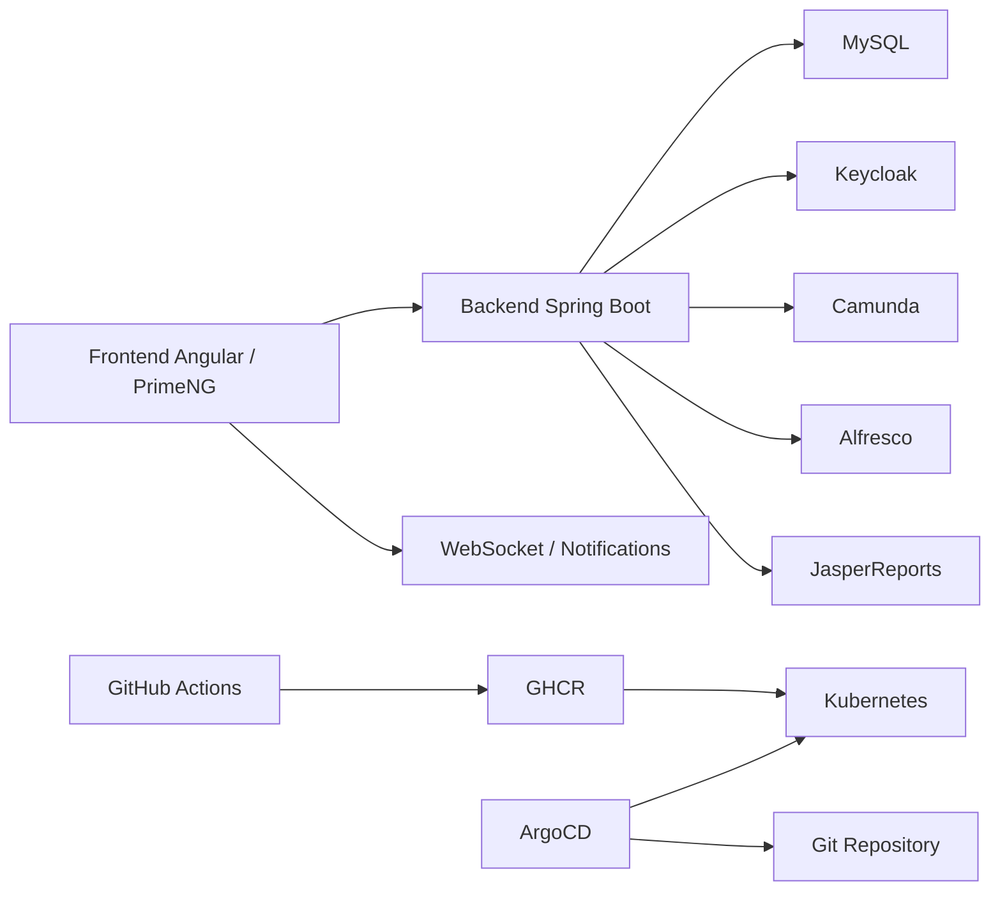

# SupportFlow

SupportFlow est une plateforme complete de gestion des tickets support client.  
Le projet couvre le cycle metier de bout en bout:

- creation de ticket
- assignation manager
- prise en charge agent
- attente client et reprise automatique
- resolution structuree
- validation ou refus client
- archivage GED et reporting
- supervision SLA, notifications et dashboard manager

Le depot contient a la fois:

- l'application metier
- les integrations techniques
- la chaine CI/CD
- la documentation de soutenance

## 1. Objectif du projet

L'objectif de SupportFlow est de transformer un support client classique en processus:

- trace
- securise
- supervisable
- automatisable
- demonstrable en soutenance

Le projet relie dans une seule solution:

- gestion des tickets
- workflow BPM
- authentification centralisee
- GED
- reporting
- supervision temps reel
- GitOps et qualite logicielle

## 2. Stack technique

| Couche | Technologie |
|---|---|
| Frontend | Angular 17 + PrimeNG + PWA |
| Backend | Spring Boot 3 + Java 17 |
| Base de donnees | MySQL |
| Workflow BPM | Camunda |
| Authentification | Keycloak |
| GED | Alfresco Share / CMIS |
| Reporting | JasperReports + Excel |
| Temps reel | WebSocket / STOMP |
| Conteneurisation | Docker / Docker Compose |
| CI/CD | GitHub Actions |
| Registry | GHCR |
| Orchestration | Kubernetes |
| GitOps | ArgoCD |
| Qualite | SonarQube + Trivy |
| Email dev | MailHog |

## Documentation technique utile

- [Guide technique complet](docs/TECHNICAL_GUIDE_SUPPORTFLOW.md)
- [Guide DevOps GitOps](docs/DEVOPS_GITOPS_SUPPORTFLOW.md)
- [Guide GitOps local Kubernetes](docs/LOCAL_GITOPS_KIND.md)
- [Guide qualite SonarQube](docs/SONARQUBE_QUALITE_SUPPORTFLOW.md)

## 3. Roles metier

### `CLIENT`

- creer des tickets
- voir ses tickets
- commenter publiquement
- repondre quand un ticket est en attente de lui
- valider ou refuser une resolution
- cloturer avec satisfaction

### `SUPPORT_AGENT`

- voir ses tickets assignes
- prendre en charge
- commenter
- mettre en attente client
- reprendre apres reponse client
- resoudre de facon structuree
- escalader si necessaire

### `SUPPORT_MANAGER`

- voir tout le backlog
- assigner ou reassigner
- superviser la charge equipe
- gerer les alertes SLA
- faire des revues manager
- piloter les notifications et les priorites

### `ADMIN`

- administrer les utilisateurs
- gerer les clients
- superviser la configuration
- intervenir sur l'ensemble du systeme

## 4. Fonctionnalites principales

## 4.1 Gestion des tickets

- creation manuelle ou par client
- priorite et contexte metier
- liste tickets avec filtres et recherche
- detail ticket riche
- statut, historique, commentaires et pieces jointes

## 4.2 Workflow support

- assignation manager
- prise en charge agent
- attente client avec motif
- reprise automatique apres reponse client
- resolution structuree
- validation ou refus client
- cloture et archivage

## 4.3 Dashboard et supervision

- dashboard manager
- file d'action manager
- charge equipe
- supervision par agent
- alertes SLA
- recommandations et reequilibrage

## 4.4 Portail client

- espace `Mes tickets`
- action attendue
- suivi du traitement
- solution proposee
- validation finale

## 4.5 Agent Workbench

- tickets a prendre
- tickets en cours
- tickets en attente client
- tickets a reprendre
- resolutions refusees

## 4.6 Notifications

- centre de notifications
- temps reel
- regroupement par ticket ou type
- actions directes
- actions groupees

## 4.7 Base de connaissance

- suggestions KB pendant la creation d'un ticket
- creation d'article KB depuis un ticket resolu
- articles lies au ticket
- reutilisation des solutions

## 4.8 GED et archives

- integration Alfresco Share
- documents lies aux tickets
- ouverture directe dans Share
- arborescence documentaire
- archives et rapports

## 4.9 Reporting

- rapport mensuel PDF
- rapport mensuel Excel
- synthese JSON
- reporting JasperReports

## 4.10 Gestion des utilisateurs

- creation / edition utilisateur
- sync Keycloak
- reset mot de passe
- reset par mail
- forcer changement au prochain login
- page profil enrichie

## 5. Cycle de vie du ticket

Le parcours principal du ticket est le suivant :

1. le client cree un ticket
2. le manager l'assigne
3. l'agent le prend en charge
4. l'agent peut demander un retour client
5. le client repond
6. le ticket repart automatiquement en traitement
7. l'agent produit une resolution structuree
8. le client valide ou refuse
9. le manager peut superviser, archiver et consulter les rapports

Les statuts metier utilises incluent notamment :

- `NEW`
- `OPEN`
- `IN_PROGRESS`
- `PENDING`
- `RESOLVED`
- `CLOSED`
- statuts d'escalade et de supervision

## 5.1 Systeme d'escalade

Le projet embarque un systeme d'escalade metier pour eviter qu'un ticket critique reste sans action, sans proprietaire ou en depassement SLA.

### Escalade manuelle

L'escalade manuelle est declenchee par un agent ou un manager quand :

- le ticket demande un arbitrage manager
- l'agent estime qu'il faut changer de niveau de traitement
- un takeover manager est necessaire
- le dossier doit etre repris par un profil plus experimente

Dans ce cas, le ticket passe dans un statut de supervision comme :

- `ESCALATED_MANUAL`

### Escalade automatique

L'escalade automatique est pilotee par l'automatisation backend et la surveillance SLA. Le moteur verifie regulierement si un ticket :

- est a risque SLA
- a depasse son SLA
- reste assigne sans progression pendant trop longtemps
- reste bloque en attente ou en escalade trop longtemps

Dans ce cas, le ticket peut passer dans un statut de supervision comme :

- `ESCALATED_SLA`

### Logique par niveaux

Le moteur d'escalade fonctionne par paliers :

1. **Niveau 1** : tentative de reequilibrage ou de reassignment intelligent vers un meilleur agent disponible
2. **Niveau 2** : revue manager, supervision renforcee et traitement prioritaire
3. **Niveau 3** : takeover fort, reprise par management ou traitement administratif plus direct

L'objectif n'est pas seulement de "marquer" le ticket comme escalade, mais de provoquer une action utile :

- reassignment
- revue manager
- augmentation de priorite
- notifications ciblees
- relance du traitement

### Declencheurs metier principaux

Les principaux declencheurs pris en charge sont :

- `SLA_AT_RISK`
- `SLA_BREACHED`
- `ASSIGNED_STUCK`
- `MANUAL_MANAGER_REVIEW`
- `MANUAL_FORCE_TAKEOVER`

Le moteur d'automatisation surveille aussi :

- les tickets `PENDING` bloques trop longtemps
- les tickets deja escalades qui stagnent
- les rappels critiques sur les dossiers SLA anciens

### Garde-fous et stabilisation

Pour eviter les escalades inutiles ou en boucle, le systeme applique plusieurs protections :

- cooldown entre deux escalades
- nombre maximal d'escalades
- possibilite de mettre l'escalade en pause temporaire
- reprise manuelle de l'escalade apres hold
- exclusion des tickets deja resolus, clotures ou annules

### Effets visibles dans l'application

Quand une escalade se produit, l'utilisateur voit concretement :

- badges d'etat sur le ticket
- alertes SLA
- notifications manager ou agent
- apparition du ticket dans la file d'action manager
- mise en avant dans le dashboard et les vues de supervision
- historique metier enrichi avec l'evenement d'escalade

Le systeme d'escalade est donc un mecanisme de supervision active, pas seulement un changement de statut.

## 6. Architecture applicative



## 7. Structure du depot

- `backend/` : API Spring Boot, metier, securite, workflow, GED, reporting
- `frontend/` : application Angular, UI, services, guards, interceptors
- `keycloak/` : realm et configuration d'authentification
- `alfresco/` : configuration GED
- `k8s/` : manifests Kubernetes et overlays
- `argocd/` : applications ArgoCD
- `postman/` : collections Postman
- `scripts/` : scripts de verification, demo, reset et exploitation
- `docs/` : documentation finale, rapport, soutenance, guides techniques

## 8. Demarrage rapide

Depuis la racine du projet :

```powershell
cd C:\Users\21655\Desktop\Support-flow
docker compose up -d --build
```

Attendre ensuite que les services deviennent `healthy`.

## 9. URLs principales

- Frontend : [http://localhost:4200](http://localhost:4200)
- Backend API : [http://localhost:8082/api](http://localhost:8082/api)
- Swagger : [http://localhost:8082/api/swagger-ui.html](http://localhost:8082/api/swagger-ui.html)
- Keycloak : [http://localhost:8180](http://localhost:8180)
- Alfresco Share : [http://localhost:8091/share](http://localhost:8091/share)
- MailHog : [http://localhost:8025](http://localhost:8025)
- SonarQube local : [http://localhost:9000](http://localhost:9000)
- ArgoCD local : [http://localhost:30086](http://localhost:30086)
- Cluster local SupportFlow : [http://localhost:30088](http://localhost:30088)

## 10. Comptes de test

- `admin / admin123`
- `manager / manager123`
- `agent1 / agent123`
- `client1 / client123`

Comptes additionnels selon le seed de demonstration :

- `agent2 / agent123`
- `agent3 / agent123`
- `client2 / client123`
- `client3 / client123`
- `client4 / client123`

## 11. Verification rapide

### Verification des services

```powershell
Invoke-WebRequest http://localhost:8082/api/actuator/health
Invoke-WebRequest http://localhost:8091/share
Invoke-WebRequest http://localhost:8180/realms/supportflow/.well-known/openid-configuration
```

### Verification soutenance recommandee

```powershell
powershell -ExecutionPolicy Bypass -File .\scripts\pre-demo-check.ps1
```

### Reseed du jeu de demo

```powershell
powershell -ExecutionPolicy Bypass -File .\scripts\reset-demo-data.ps1
```

## 12. Scripts utiles

- `scripts/pre-demo-check.ps1` : verification globale avant demonstration
- `scripts/reset-demo-data.ps1` : recharge du jeu de donnees de demo
- `scripts/test-ticket-guide.ps1` : test du scenario ticket principal
- `scripts/check-alfresco-camunda-e2e.ps1` : verification GED / Camunda
- `scripts/validate-remote-gitops.ps1` : verification de la chaine GitOps
- `scripts/bootstrap-kind-cluster.ps1` : bootstrap cluster local kind
- `scripts/bootstrap-local-argocd.ps1` : bootstrap ArgoCD local

## 13. GitHub Actions, Kubernetes et ArgoCD

Le projet embarque une vraie logique CI/CD / GitOps :

### GitHub Actions

Le workflow principal se trouve dans :

- [.github/workflows/ci-cd.yml](.github/workflows/ci-cd.yml)

Il fait notamment :

- build backend
- build frontend
- security scan
- analyse SonarQube
- build et push des images Docker dans GHCR

### Kubernetes

Les manifests sont dans :

- `k8s/base/`
- `k8s/overlays/local/`
- `k8s/overlays/staging/`
- `k8s/overlays/prod/`

### ArgoCD

Les applications ArgoCD sont dans :

- `argocd/supportflow-local.yaml`
- `argocd/supportflow-staging.yaml`
- `argocd/supportflow-prod.yaml`

ArgoCD synchronise automatiquement le cluster a partir du Git.

## 14. SonarQube et qualite

Le projet integre :

- SonarQube pour l'analyse de qualite
- Trivy pour le scan securite

Un projet SonarQube local peut etre visualise dans :

- [http://localhost:9000](http://localhost:9000)

Le script local de relance de l'analyse est :

- `scripts/run-local-sonarqube-analysis.ps1`

## 15. Demonstration recommandee

Scenario simple pour un jury ou un encadrant :

1. client1 cree un ticket avec suggestion KB
2. manager assigne le ticket
3. agent1 prend en charge et traite
4. agent1 met en attente client
5. client1 repond
6. agent1 reprend et resolve
7. client1 valide ou refuse
8. manager consulte dashboard, GED et rapport
9. en parallele, montrer GitHub Actions, SonarQube et ArgoCD

## 16. Documentation complete

Index principal :

- [docs/README.md](docs/README.md)

Documents les plus utiles :

- [docs/QUICKSTART.md](docs/QUICKSTART.md)
- [docs/GUIDE_UTILISATEUR_SUPPORTFLOW.md](docs/GUIDE_UTILISATEUR_SUPPORTFLOW.md)
- [docs/RAPPORT_FONCTIONNEL.md](docs/RAPPORT_FONCTIONNEL.md)
- [docs/DEVOPS_GITOPS_SUPPORTFLOW.md](docs/DEVOPS_GITOPS_SUPPORTFLOW.md)
- [docs/REMOTE_EXECUTION_GITHUB_ARGOCD.md](docs/REMOTE_EXECUTION_GITHUB_ARGOCD.md)
- [docs/LOCAL_GITOPS_KIND.md](docs/LOCAL_GITOPS_KIND.md)
- [docs/SONARQUBE_QUALITE_SUPPORTFLOW.md](docs/SONARQUBE_QUALITE_SUPPORTFLOW.md)
- [docs/PWA_VALIDATION_SUPPORTFLOW.md](docs/PWA_VALIDATION_SUPPORTFLOW.md)
- [docs/SOUTENANCE_SUPPORTFLOW.md](docs/SOUTENANCE_SUPPORTFLOW.md)

## 17. Livrables deja prepares

- presentation de soutenance
- rapport complet du projet
- memoire LaTeX long
- collection Postman
- scripts de verification et de demonstration

Exemples :

- [docs/SupportFlow-Rapport-Complet.pptx](docs/SupportFlow-Rapport-Complet.pptx)
- [postman/SupportFlow-Full-Workflow.postman_collection.json](postman/SupportFlow-Full-Workflow.postman_collection.json)

## 18. Etat du projet

Le projet est dans un etat demonstrable et techniquement coherent :

- application metier fonctionnelle
- workflows et roles en place
- integrations principales branchees
- CI/CD operationnelle
- GitOps local verifiable
- documentation et soutenance preparees

Les evolutions futures peuvent porter sur :

- enrichissement de la base de connaissance
- SLA encore plus avances
- analytics manager plus fines
- experience cluster distante plus complete
