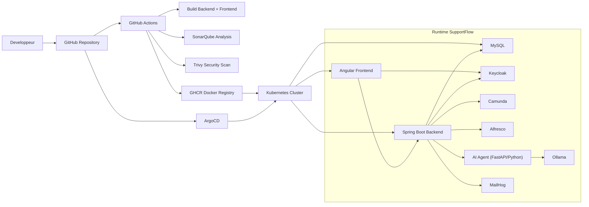

# Guide Technique SupportFlow

## 1. Objectif

Ce guide technique explique l'architecture de SupportFlow, la chaine CI/CD, le role des composants d'infrastructure et la circulation des donnees entre les services.

Il sert a :

- comprendre la structure technique du projet
- expliquer la plateforme a un encadrant ou a un jury
- faciliter la maintenance et l'exploitation
- clarifier la chaine `GitHub Actions -> GHCR -> Kubernetes -> ArgoCD`

## 2. Vue d'ensemble

SupportFlow est une plateforme de gestion de tickets support construite autour de :

- un frontend Angular 17 + PrimeNG + PWA
- un backend Spring Boot 3 + Java 17
- une base MySQL
- une authentification centralisee Keycloak
- un moteur de workflow Camunda
- une GED Alfresco
- un service IA Python connecte a Ollama
- une chaine GitOps avec GitHub Actions, GHCR, Kubernetes et ArgoCD

## 3. Schéma d'architecture technique

## 4. Architecture applicative

### 4.1 Frontend

Le frontend est developpe avec Angular 17. Il fournit :

- le dashboard manager
- le portail client
- l'agent workbench
- le detail ticket
- le centre de notifications
- la base de connaissance
- les pages utilisateurs, clients, archives et rapports

Responsabilites principales :

- afficher les vues metier
- appeler les API REST
- gerer l'authentification front avec Keycloak
- consommer les evenements WebSocket
- fournir une experience PWA

Emplacements utiles :

- [frontend/src/main.ts](/C:/Users/21655/Desktop/Support-flow/frontend/src/main.ts)
- [frontend/src/app/app.routes.ts](/C:/Users/21655/Desktop/Support-flow/frontend/src/app/app.routes.ts)
- [frontend/src/app/core/services](/C:/Users/21655/Desktop/Support-flow/frontend/src/app/core/services)

### 4.2 Backend

Le backend est base sur Spring Boot 3 et Java 17.

Responsabilites principales :

- exposer les API REST
- porter la logique metier des tickets
- appliquer les regles de roles et permissions
- declencher les transitions workflow
- gerer le SLA, les escalades et les notifications
- piloter la GED, les rapports et les integrations externes

Structure logique :

- `controller` : points d'entree REST
- `service` : logique metier
- `repository` : acces a la base
- `entity` : modele persistant
- `dto` : contrats d'echanges
- `config` : securite, websocket, OpenAPI, etc.

Emplacements utiles :

- [backend/src/main/java/com/supportflow/controller](/C:/Users/21655/Desktop/Support-flow/backend/src/main/java/com/supportflow/controller)
- [backend/src/main/java/com/supportflow/service](/C:/Users/21655/Desktop/Support-flow/backend/src/main/java/com/supportflow/service)
- [backend/src/main/java/com/supportflow/entity](/C:/Users/21655/Desktop/Support-flow/backend/src/main/java/com/supportflow/entity)

## 5. Composants d'infrastructure

### 5.1 MySQL

MySQL stocke le coeur transactionnel :

- tickets
- utilisateurs metier
- commentaires
- pieces jointes
- historique
- notifications
- regles d'escalade
- connaissances et satisfaction

### 5.2 Keycloak

Keycloak gere :

- l'authentification centralisee
- les roles `CLIENT`, `SUPPORT_AGENT`, `SUPPORT_MANAGER`, `ADMIN`
- le login, logout et reset password
- la delivrance des tokens JWT

Le frontend s'authentifie via Keycloak et le backend valide les JWT pour proteger les API.

### 5.3 Camunda

Camunda orchestre le workflow des tickets.

Il sert a :

- suivre les etapes du cycle de vie
- declencher certaines transitions
- rendre le processus visible dans Cockpit

Le modele BPMN est dans :

- [backend/src/main/resources/bpmn/ticket-workflow.bpmn](/C:/Users/21655/Desktop/Support-flow/backend/src/main/resources/bpmn/ticket-workflow.bpmn)

### 5.4 Alfresco

Alfresco joue le role de GED :

- archivage des documents lies aux tickets
- ouverture directe dans Share
- consultation des dossiers depuis le detail ticket
- conservation des preuves documentaires

### 5.5 JasperReports

JasperReports est utilise pour le reporting :

- rapports mensuels PDF
- export Excel
- synthese exploitable pour le management

### 5.6 Service IA + Ollama

L'IA dans SupportFlow n'est pas appelee directement depuis le frontend.

Architecture IA :

1. le frontend appelle le backend
2. le backend appelle un microservice Python `ai-agent`
3. `ai-agent` construit le contexte metier
4. `ai-agent` interroge Ollama
5. le resultat revient au frontend

Usages principaux :

- resume operationnel du ticket
- suggestion de reponse
- suggestions KB
- resume d'escalade
- aide a la capitalisation

Fichiers utiles :

- [ai-agent/main.py](/C:/Users/21655/Desktop/Support-flow/ai-agent/main.py)
- [backend/src/main/java/com/supportflow/controller/AIAssistantController.java](/C:/Users/21655/Desktop/Support-flow/backend/src/main/java/com/supportflow/controller/AIAssistantController.java)

## 6. Chaine CI/CD et GitOps

## 6.1 GitHub Actions

Le workflow principal est :

- [/.github/workflows/ci-cd.yml](/C:/Users/21655/Desktop/Support-flow/.github/workflows/ci-cd.yml)

Il execute automatiquement :

1. build backend
2. build frontend
3. analyse SonarQube
4. scan securite Trivy
5. build et push des images Docker
6. mise a jour des manifests si necessaire

## 6.2 GHCR

Les images construites sont publiees dans GitHub Container Registry :

- `ghcr.io/mejrioussama/supportflow-backend`
- `ghcr.io/mejrioussama/supportflow-frontend`

## 6.3 Kubernetes

Kubernetes sert a executer l'application de facon orchestree.

Le depot contient :

- `k8s/base` : socle commun
- `k8s/overlays/local` : execution locale
- `k8s/overlays/staging` : environnement develop
- `k8s/overlays/prod` : environnement principal

## 6.4 ArgoCD

ArgoCD applique la logique GitOps :

- surveille le depot Git
- lit les manifests Kubernetes
- synchronise automatiquement le cluster

Applications presentes :

- [argocd/supportflow-local.yaml](/C:/Users/21655/Desktop/Support-flow/argocd/supportflow-local.yaml)
- [argocd/supportflow-staging.yaml](/C:/Users/21655/Desktop/Support-flow/argocd/supportflow-staging.yaml)
- [argocd/supportflow-prod.yaml](/C:/Users/21655/Desktop/Support-flow/argocd/supportflow-prod.yaml)

## 7. Circulation metier d'un ticket

```mermaid
flowchart LR
    Client["Client"] --> Create["Creation du ticket"]
    Create --> Assign["Assignation manager"]
    Assign --> Work["Prise en charge agent"]
    Work --> Pending["Attente client si necessaire"]
    Pending --> Reply["Reponse client"]
    Reply --> Resume["Reprise automatique"]
    Resume --> Resolve["Resolution structuree"]
    Resolve --> Validate["Validation ou refus client"]
    Validate --> Close["Cloture"]
    Close --> Archive["Archivage GED + Reporting"]
```

Composants impliques dans ce flux :

- frontend pour les interactions utilisateur
- backend pour les regles metier
- Keycloak pour l'identite
- Camunda pour le workflow
- WebSocket pour les notifications temps reel
- Alfresco pour les documents
- JasperReports pour les rapports

## 8. WebSocket et temps reel

SupportFlow utilise WebSocket / STOMP pour :

- notifier les changements de statut
- propager les commentaires
- mettre a jour certaines alertes temps reel

Configuration utile :

- [backend/src/main/java/com/supportflow/config/WebSocketConfig.java](/C:/Users/21655/Desktop/Support-flow/backend/src/main/java/com/supportflow/config/WebSocketConfig.java)

## 9. Qualite et verification

Les mecanismes de controle principaux sont :

- builds backend/frontend
- SonarQube
- Trivy
- scripts de verification
- tests de scenarios metier

Scripts utiles :

- [scripts/pre-demo-check.ps1](/C:/Users/21655/Desktop/Support-flow/scripts/pre-demo-check.ps1)
- [scripts/test-ticket-guide.ps1](/C:/Users/21655/Desktop/Support-flow/scripts/test-ticket-guide.ps1)
- [scripts/validate-remote-gitops.ps1](/C:/Users/21655/Desktop/Support-flow/scripts/validate-remote-gitops.ps1)

## 10. Environnements d'execution

### Local Docker

Le mode le plus direct pour la demo locale.

Services principaux :

- frontend
- backend
- mysql
- keycloak
- camunda
- alfresco
- ai-agent
- ollama
- sonarqube
- mailhog

### Cluster local Kubernetes

Utilise pour demontrer GitOps, ArgoCD et le deploiement K8s local.

### Staging / Prod

Le depot est prepare pour :

- `develop` -> staging
- `main` -> prod

## 11. Comment expliquer ce guide a l'oral

Tu peux presenter l'architecture comme suit :

1. le developpeur pousse sur GitHub
2. GitHub Actions build, teste, scanne et publie les images
3. GHCR stocke les images
4. ArgoCD lit les manifests versionnes
5. Kubernetes deploie l'application
6. le frontend appelle le backend
7. le backend s'appuie sur Keycloak, Camunda, Alfresco, Jasper et l'agent IA

Phrase simple pour l'oral :

> SupportFlow est une plateforme support basee sur une architecture decouplee. Angular gere l'experience utilisateur, Spring Boot porte la logique metier, Keycloak securise les acces, Camunda gere le workflow, Alfresco archive les documents, Jasper produit les rapports, et GitHub Actions avec ArgoCD automatisent la livraison sur Kubernetes.

